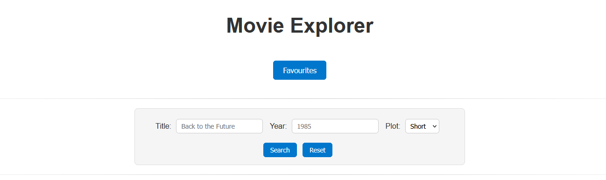
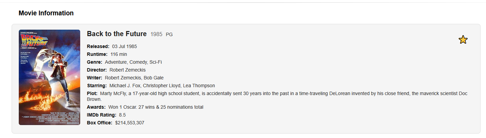
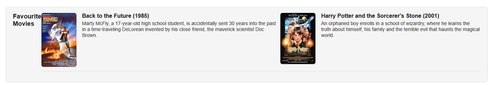

Movie Explorer 🎬

Movie Explorer is a simple web application that allows users to search for movies and view detailed information about them using the OMDb API.

Features

Search for movies by title and year.

Choose between a short or full plot description.

Display movie details neatly with poster on the left and information on the right.

Favourites: Mark movies as favourites and view them instantly on the same page (no data stored).

Reset search to clear fields.

Clean and responsive design using HTML, CSS, and JavaScript.

Screenshot

Search Interface:

Movie Details:

Favourites:

How to Use:

Enter the movie title and optionally the year.

Select the plot length (short or full).

Click Search to fetch movie information.

The Star button on the movie information is how you favourite a movie

Click Favourites to see the movies you’ve marked as favourite.

Click Reset to clear fields.

Technologies Used

HTML

CSS

JavaScript

OMDb API

Notes

This project is a small experiment to explore API integration and dynamic front-end rendering. It’s a fun way to practice working with real-world data and building interactive web apps.
